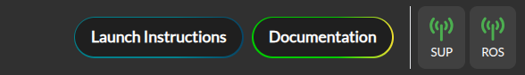
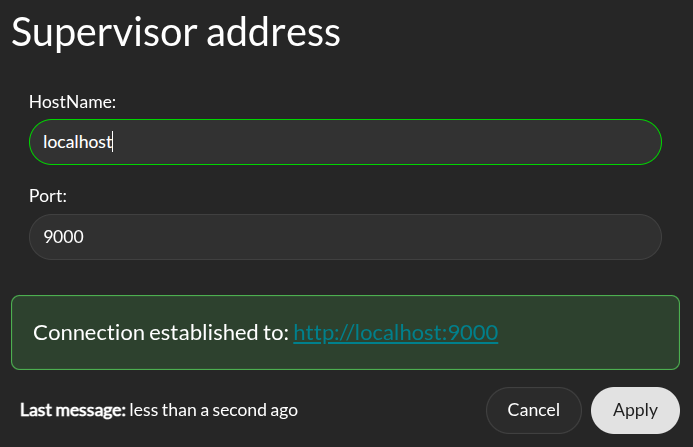
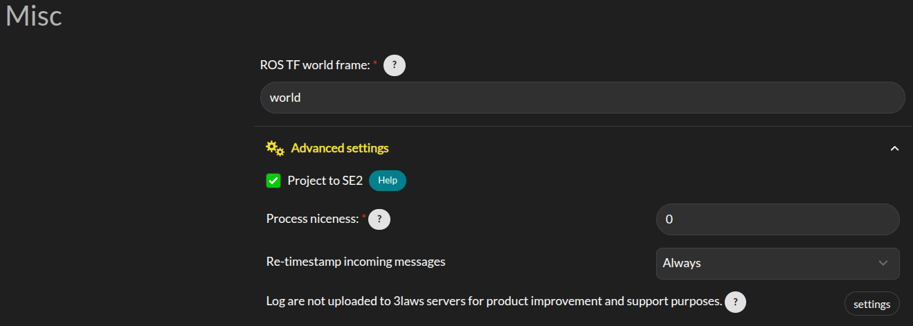

.. _control_panel_config:

General Configuration
#####################

.. note::
  Throughout this documentation, a red asterisk (*) indicates a *required* field.

.. _rosbridge_connection:

External Connections
====================

The right top side of the navigation bar has two buttons to configure connections to the Supervisor and to the ROS ``rosbridge-websocket``.

|

Supervisor connection
---------------------

Click on the left antenna icon to open the configuration page for the Supervisor connection. In order for the connection to be established, you have to configure the IP address and port to the same value defined in the advanced section of the general configuration page.

|

This connection allow for all panel in the Operation tab to receive live data stream. A **green** status icon indicates that the Supervisor is connected to the Control Panel, while a **red** icon indicates that the connection was not successful.

Rosbridge Connection
--------------------

The Control Panel supports a topic autocompletion capability when paired with a ``rosbridge server`` (see `rosbridge documentation <https://github.com/RobotWebTools/rosbridge_suite>`_ for more details). The robot's ROS stack (without Supervisor) needs to be running and publishing topics for this feature's proper operation. With this interface, the Control Panel can retrieve information about the available topics and help you complete the configuration of the Supervisor. This is not required and will be deactivated by default.

First, install the rosbridge suite by running the following command (where <distro> is replaced with the ROS distribution in use on the system):

  .. code-block:: bash

    sudo apt-get install ros-<DISTRO>-rosbridge-suite

Then, run the following command to start the rosbridge websocket:

  .. code-block:: bash

    ros2 launch rosbridge_server rosbridge_websocket_launch.xml

This will provide a websocket server at **`ws://localhost:9090`**.

The Control Panel can connect to this websocket in order to retrieve topics and services information. In order to configure the connection, click on the left antenna icon. From the configuration window, you can set the IP address and port of the Rosbridge server to which the Control Panel should connect to.

.. image:: ../data/rosbridge_connection_modal.png
  :align: center
  :width: 600px
  :alt: Rosbridge connection dialog.

|

In addition if you launch the supervisor in a global namespace you can specify it there so that the predefined RVIZ configuration take this namespace in consideration.

A **green** status icon indicates that the Control Panel is connected to the Rosbridge server, while a **red** icon indicates that the Control Panel is not connected.

Credentials
===========

The *Credentials* page appears as follows:
When entering a license key, meta information about the license will be displayed. This information includes the expiration date, issue date, and the cloud option associated with the license. If the license key is invalid, an error message will be displayed.

.. image:: ../data/credentials_tab.png
  :align: center
  :width: 700px
  :alt: Configuration > Credentials Page

|

- **Credentials**: 3Laws will provide a license key based on the version of Supervisor that has been purchased/downloaded.  The license key incorporates an expiration date. If a trial license was obtained, the expiration date is 60 days from the request date for the trial.
- **Robot Name**: This identifier will be different for each robot where Supervisor is installed. It should contain a name you can use to identify an individual robot. Note that each license of Supervisor is only valid for a single platform/robot.

Misc
====

|

- **ROS TF worldframe**: This is the name of world frame used by the robot. It is used to transform the robot's pose to the world frame.

- **Advanced Settings > Project to SE2**: By default, the system is assumed to operate in a 3D space. Projecting to SE2 (2D special Euclidean group) means that instead of considering a full 3D robot's pose (position and orientation), we only consider it as a 2D object on a plane. This is acceptable if the vehicle is traveling on a flat surface and its traveled distance is small enough that earth curvature effects are not significant. In practice, when mapping from 3D space to 2D space, the system is assumed to have zero roll and pitch while being placed on the ground. No rotational velocities or acceleration are assumed around roll and pitch, and zero vertical velocity and acceleration are assumed. This will also map the received state to the SE2 state space. A helper window is available to describe the mapping.

- **Advanced Settings > Process niceness**:  The computational priority of the Supervisor node application on the host operating system can be set through the "niceness" parameter (-20 for very high priority, +19 for very low priority). A niceness of zero is recommended. (Please review documentation on setting priority in Linux using "nice" for a deeper explanation.)

- **Advanced Settings > Retimestamp policy**: control whether the Supervisor will re-stamp the messages it receives from the robot's stack. This is useful when the robot's stack is not providing a timestamp on the messages it publishes. The Supervisor will use the current time as the timestamp for these messages. The re-stamping policy can be set to "if-zero", "always", or "never". The "if-zero" option will only re-stamp the messages if the timestamp is missing.

- **Advanced Settings > Upload log to 3laws robotics cloud**: For debugging purposes, 3Laws creates a log file when Supervisor is started. The file is stored in *~/.3laws/logs*. Enabling this option allows 3Laws to provide better support with troubleshooting if there is a problem.
