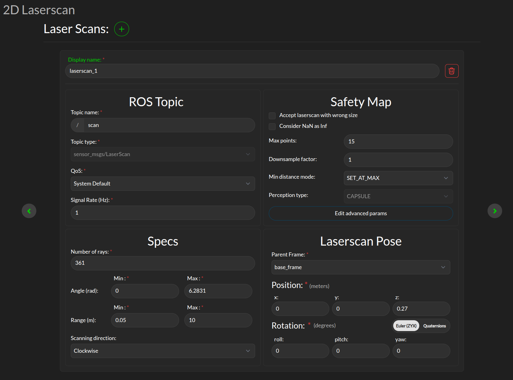
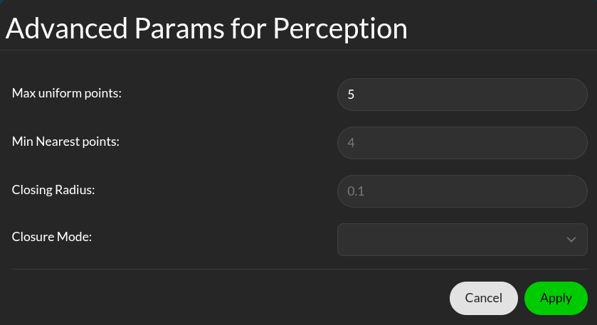
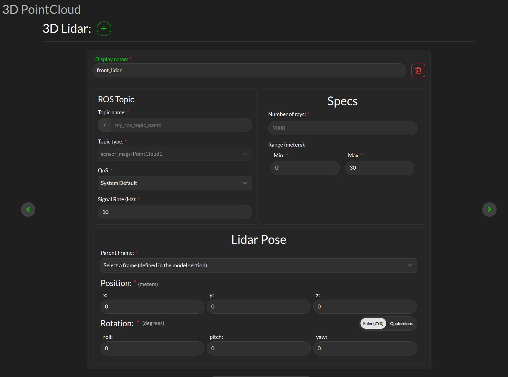

Perception
##########

The Supervisor uses settings in this page to interface sensors' data, configure safety maps, and eventually understand the environment at run-time. The Supervisor uses information about the environment in the form of 2D laserscans and/or 3D LIDARs data or an object map, or a combination of them.

|

.. _config_perception_laserscan:

Laserscan sensor
----------------

The Supervisor can process data from multiple laserscans, but each of them must be configured separately. Use the **+** icon to add a new laserscan configuration tab.

* **Display name**: This display name is used when aggregated statistics about the scanner are uploaded to the 3Laws cloud dashboard. This name is chosen by the user to help keep track of the scanner, e.g. "front_laser".

* **ROS Topic**: The information entered in this panel needs to match the details on the ROS topic containing the laserscan data to be consumed by the Supervisor. *ros2 topic* with options *list, info, hz* can be useful to obtain this information.

* **Specs**:

  * **Number of rays**: The number of points per scan contained in a single message.
  * **Angle**: The first (typically minimum) and last (typically maximum) angle to calculate the angular resolution for the nominal case. The first and last angle values should describe a laser that scans in the clockwise direction, so the first is smaller than the last. However, if the laser scans in the counter-clockwise direction the first angle should be set to be smaller than the last. Make sure the total range of the laser is less than 2π. The Supervisor does not disambiguate angles if the total field is larger than 2π.
  * **Range**:  The scanner's range can be set so that readings smaller than the minimum or larger than the maximum are discarded. Setting this value incorrectly will result in valid laserscan data being discarded.
  * **Scanning direction**: The scanning direction of the laserscan (clockwise or counter-clockwise).

* **Safety Map** Here you can configure how the raw data received from the laserscan is processed before being consumed by the Supervisor. See :ref:`Safety Map <safety_maps>` for more details on how the safety map is used by the Supervisor. The following parameters are available:

  * **Max points**: The maximum number of laserscan points that are going to be used by the Supervisor. If the number of points after downsampling (see next line) is less, this value is ignored.
  * **Downsample factor**: The downsample factor is used to reduce the number of points in the laserscan. The Supervisor will take every nth point from the laserscan, where n is the downsample factor. For example, if the downsample factor is 2, every second point will be taken from the laserscan. The minimum value between the number of points after downsampling and **Max points** will be actual number of safety constraints enforced by the Supervisor.
  * **Min distance mode**: This controls the rule applied to the points that are closer than the minimum range (as defined in **Specs**). The options are:
    * **Clamp at min**: Replace actual distance with set minimum distance value.
    * **Set at max**: Replace actual distance with set maximum distance value.
    * **Set at infinity**: Replace actual distance with infinity (this effectively ignores the point from the scan).

* **Laserscan Pose**: The orientation and position of the laserscan relative to the vehicle body or whichever frame is used must be specified. As with the robot's body position, the user is advised to plot the data in rviz to ensure that the geometry is set correctly.

Safety maps advanced params
^^^^^^^^^^^^^^^^^^^^^^^^^^^

|

.. _config_advanced_lidar:

**Min nearest points**: The number of points closest to the robot to be considered. The actual number of nearest points can be more than the selected value, if this and the number of **max uniform points** (see below) does not add up to the total number of safety constraints we selected.

**Max uniform points**: Number of uniformly sampled points to be considered.

Lidar sensor
------------

The Supervisor can processes data points from multiple 3D lidar.

|

.. _config_perception_lidar:

* **Display name**: This display name is used when aggregated statistics about the scanner are uploaded to the 3Laws cloud dashboard. This name is chosen by the user to help keep track of the scanner, e.g. "front_lidar".

* **ROS Topic**: Supervisor needs to subscribe to the ROS message published by the LIDAR, so this topic name (plus type, quality-of-service, and expected signal rate) need to match the sensor's output. *ros2 topic* with options *list, info, hz* can be useful to obtain this information.

* **Specs**:

  * **Number of rays**: The number of rays emitted by the LIDAR (point number).

  * **Range**: The maximum range of the LIDAR in meter.

* **Lidar Pose**: The orientation and position of the laserscan relative to the vehicle body or whichever frame is used must be specified. As with the robot's body position, the user is advised to plot the data in rviz to ensure that the geometry is set correctly.

.. _config_perception_obstacles:

Obstacle Map
------------

An existing perception system can be used instead of raw 2D-LIDAR data, but it must provide an ObjectArray that matches the definition for an lll_msgs/ObjectArray (see :ref:`Run-time Assurance Module section <rta_obstacles>`).
