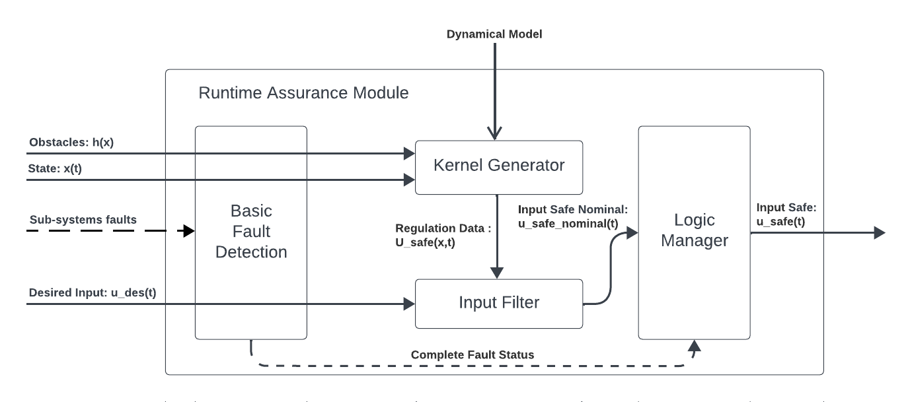
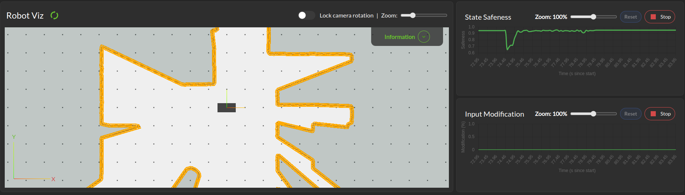
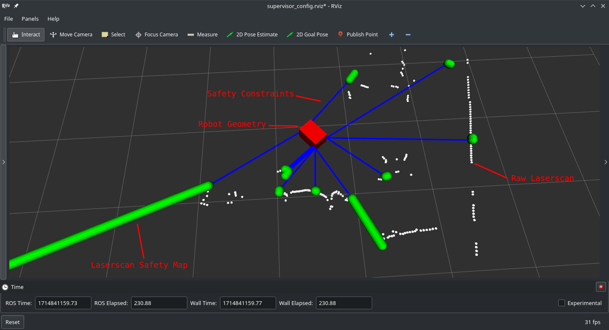

Run-time Assurance
####################

.. _contact 3Laws: mailto:sales@3laws.io

.. contents:: Table of Contents
  :local:

The Run-time Assurance Module (RAM) is the heart of the Supervisor. This module is responsible for calculating the appropriate command to send to the robot to stay "safe" based on available system information. It is built as 3 main components:

|

- **The Kernel Generator** uses
    - an appropriate dynamical system Model,
    - the system's current state,
    - the predicted environment state, and
    - a set of possible actions that can be taken to keep the system safe

  to calculate a set of "safe" commands that can be applied to the system.  This set of actions is then passed to the input filter.

- **The Input Filter** selects the command that is a closest to the desired command sent by the autonomy stack from the set of safe commands produced by the Kernel Generator.

- **Fault Manager** detects basic faults (e.g. signal timeouts) from the signals sent by the autonomy stack to the RAM and implements appropriate stopping strategies.

Dynamical Model
===============

In order for the kernel generator to determine the set of safe commands that can be sent to the robot, it must be able to quantify  how the robot will behave when it receives a particular command. This is done through the use of a dynamical model.

A dynamical model of a robot is defined by 6 items:

- A **state** vector :math:`x \in \mathbb{R}^\text{nx}` representing the set of relevant physical quantities for that robot (position, orientation, velocity ...).

- An **input** vector :math:`u \in \mathbb{R}^\text{nu}`  representing the set of relevant cyber-physical quantities for that robot that can be controlled directly (motor torque, desired velocity, desired rotation rate ...).

- A set of **equations of motion** in vectorized form :math:`\dot{x} = f(x,u)` that describe how the state of the robot evolves over time when it receives a particular input. These equations of motions will often be parameterized by known fixed quantities :math:`p \in \mathbb{R}^\text{np}` called **model parameters** (mass, distance between wheels, maximum/minmum accelerations, maximum turn rates,...),i.e. :math:`\dot{x} = f(x,u,p)`

- A set of **input constraints** :math:`U \subseteq \mathbb{R}^\text{nu}` that affect the set of all possible inputs that can be sent to the robot.

- A **state domain** set :math:`X \subseteq \mathbb{R}^\text{nx}` that represents the domain for which the equations of motion are valid, particularly with respect to the process covariance matrix.

- A **process noise covariance matrix** which represents the probability distribution of the actual :math:`\dot{x}` around the predicted value by :math:`f(x,u)` for all given :math:`x \in X` and :math:`u \in U`.

The Supervisor currently ships with 3 supported dynamical models:

Unicycle
--------
This model is a 3-state, 2-input model that describes the movement of a robot evolving on SE2 (2D planar space with orientation), where control is available for longitudinal and angular velocities directly. This model is particularly well suited for differential drive robots with fast acceleration and deceleration.

  - Model state: :math:`\left[x,y,\theta \right]`

  - Model input: :math:`\left[ v_x, \omega \right]`

  - Model parameters: None

  - Equations of motion: :math:`\begin{cases} \dot{x} = v_x \cos(\theta) \\ \dot{y} = v_x \sin(\theta) \\ \dot{\theta} = \omega \end{cases}`

  - State domain: :math:`\mathbb{R}^3`

  - Input constraints: User defined `hyperbox <https://en.wikipedia.org/wiki/Hyperrectangle>`_ in :math:`\mathbb{R}^2`

  - Process noise covariance matrix: Identity matrix

Omnidirectional
---------------
This model is a 3-state, 3-input model that describes the movement of a robot evolving on SE2 (2D planar space with orientation) where control is available for longitudinal, lateral, and angular velocities directly. This model is particularly well suited for mobile robots with omni wheels, quadrupeds, and surface vessels with fast acceleration and deceleration.

  - Model state: :math:`\left[x,y,\theta \right]`

  - Model input: :math:`\left[ v_x, v_y, \omega \right]`

  - Model parameters: None

  - Equations of motion: :math:`\begin{cases} \dot{x} = v_x \cos(\theta) - v_y \sin(\theta) \\ \dot{y} = v_x \sin(\theta) + v_y \cos(\theta) \\ \dot{\theta} = \omega \end{cases}`

  - State domain: :math:`\mathbb{R}^3`

  - Input constraints: User defined `hyperbox <https://en.wikipedia.org/wiki/Hyperrectangle>`_ in :math:`\mathbb{R}^3`

  - Process noise covariance matrix: Identity matrix

Bicycle (experimental)
--------------------------
This model is a 3-state, 2-input model that describes the movement of a robot evolving on SE2 (2D planar space with orientation) where the controls are longitudinal speed and front wheel steering angle. This model is particularly well suited for mobile robots with front wheel steering.

  - Model state: :math:`\left[x,y,\theta \right]`

  - Model input: :math:`\left[ v_x, \delta \right]`

  - Model parameters:

    - :math:`wheel_{dx}`: (wheelbase) Distance between front and rear wheel axles (m)

    - :math:`origin_{dx}`: Position of vehicle origin w.r.t rear axle (m)

  - Equations of motion: :math:`\begin{cases} \dot{x} = v_x \cos(\theta) \\ \dot{y} = v_x \sin(\theta) \\ \dot{\theta} = v_x * \tan(\delta) * \frac{\cos(\beta)}{wheel_{dx}} \end{cases}`

    where sideslip is :math:`\beta = \arctan(\frac{origin_{dx}}{wheel_{dx}}\tan(\delta))`

  - State domain: :math:`\mathbb{R}^3`

  - Input constraints: User defined `hyperbox <https://en.wikipedia.org/wiki/Hyperrectangle>`_ in :math:`\mathbb{R}^2`. Note that the steering angle must be between :math:`-\frac{\pi}{2}` and :math:`\frac{\pi}{2}`.

  - Process noise covariance matrix: Identity matrix

.. note::
  The Supervisor technology is able to support a wide variety of dynamical models with multiple levels of complexity. Use of a more accurate dynamical model allows for smaller margins and higher performance from the system. Please `contact 3laws`_ to discuss implementation of more tailored versions of Supervisor to meet different application needs.

.. _safety_maps:

Safety Maps
===========

The other critical RAM component is the definition of what the robot should avoid. Although the Supervisor's core technology is able to enforce any arbitrary non-linear constraint on the robot's state, in the current implementation we focus on separation constraints (i.e., at all times, there should exist a minimum separation between the robots and its surrounding obstacles). These constraints are organized into what we call **Safety Maps**. A safety map is an object defining a set of robot state constraints. It can be updated when new information about the robot environment is available. The constraints to be enforced can then be evaluated at a given robot state and return a vector of the values at that state, along with information on the gradient of the constraints w.r.t variations in state.

The Supervisor ships with three safety maps:
  - One based on 2D laserscan points that define discrete number of constraints in a 2D space.
  - One based on 3D lidar that define discrete constraints in a 3D space.
  - One last based on a list of obstacles with absolute locations.

Laserscan and Lidar
-------------------
The laserscan and lidar safety maps defines constraints corresponding to the distance between the robot geometry and a carefully chosen set of `capsules <https://en.wikipedia.org/wiki/Capsule_(geometry)>`_ capturing the critical points in the laserscan or lidar. The Supervisor enforces a constraint that the robot does not collide (intersect) with any of these capsules. The capsule sizes are defined through the **collision distance threshold** parameter (see :ref:`control panel configuration <config_sup_collision_distance>`).

This safety map gets updated every time a new scan gets received on the specified topic (see :ref:`control panel configuration <config_perception_laserscan>`).

.. _rta_obstacles:

Obstacles
---------

The obstacle safety map defines constraint equations corresponding to the distance between the robot geometry and a list of obstacles geometries.

This safety map gets updated every time a new list of obstacles is received on the specified topic (see :ref:`control panel configuration <config_perception_obstacles>`).

This list of obstacles is a topic of type ``lll_msgs/ObjectArray``:

.. code:: text

  std_msgs/Header header
  Object[] objects

where the following fields of Object must be specified:

.. code:: text

  std_msgs/Header header

  # Identifier of the object
  string id

  # Object geometry, and pose of geometry in object frame
  ObjectGeometry geometry

  # Object pose world frame
  geometry_msgs/PoseWithCovariance pose

.. note::
  The Supervisor core technology supports many more sensors and constraint representations. Please `contact 3laws`_ to learn more about all the type of constraints that can be implemented to satisfy other applications' needs.

Operations and Fault Management
===============================

The RAM performs its computations at regular intervals, whose rate is specified by **Filter rate** parameter (see :ref:`control panel configuration <config_sup_filter_rate>`). It therefore requires a continuous and consistent flow of data from 3 sources to be processed during that interval, namely:

  * Perception - Sensor and mapping data
  * Localization - State estimate
  * Planning - Desired input

The Fault Management part of the RAM is therefore in charge of managing 4 modes of operation with configurable behaviors (see :ref:`control panel configuration <config_sup_fault_management>`):

- **Passthrough**: The RAM publishes the latest desired input message it received un-altered. It won't publish anything until a first message has been received. This mode can be transition in-to and out-of at any time by publishing a boolean to the **/lll/ram/enable** topic (false to enter Passthrough mode, true to exit Passthrough mode).

- **Initialization**: Waiting to receive a first message from one of the 3 critical sources of data.

- **Nominal operation**: The RAM is publishing the best "safe" input command based on the latest data received.

- **Fault**: The RAM is not able to perform its function due to an internal error or an external timeout, and realizes the configured **Failure Command Mode**:

  * Send Zero: An input of 0 is published.

  * Do not publish: Not input is published. This option should only be used if the robot has its own mechanism to put itself in a safe condition if it is not receiving commands.

  * Passthrough: The latest desired command is published. This option must be used with care as it will give the planning stack (and particularly human drivers) a false sense of the RAM being functional when it actually isn't.

.. important::
  Whether or not the RAM is allowed to leave a Fault mode and recover from it is configurable inside the :ref:`control panel <config_sup_fault_management>`.

Behavior Tuning
===============

The RAM algorithm tries to find the best balance between balance between being minimally intrusive and being "smooth" in its interventions. This tradeoff can be modulated with the **Aggressiveness**, **Pointiness**, and **Evasion Aggressiveness** parameters (see :ref:`control panel configuration <config_sup_tuning>`):

.. note::
  The Supervisor can handle more complex and case specific metrics of optimality. Please `contact 3laws`_ to discuss implementations that better suit your application needs.

Localization
============

The RAM relies on localization to corelate the position of obstacles with the position of the robot, as well as for visualization. If the source of localization is not reliable, one can configure the the RAM to not use :ref:`localization <config_sup_loc>`, in which case, the robot will be assumed to always be at the center of the world, and the obstacles must be located in the robot frame.

Handling uncertainties and delays
=================================

The mathematical formulations used by the RAM rely on an implicit assumption about an exact knowledge of localization, perception, and dynamics data. The effectiveness of the Supervisor is therefore correlated to the validity of that assumption, which is hard to verify in practice. It is therefore important to introduce some conservatism in the RAM formulation, which can be done heuristically through parameters like **Conservativeness**, **Collision distance threshold**, and **Aggressiveness**.

.. important::
  There exist a fundamental trade-off between conservatism and optimality at the control level. The more certainty one has in things like dynamics, localization, and communication timing, the less conservatism must be introduced to ensure a low probability of collision.

  The Supervisor is able to account for uncertainty in an explicit and quantitative way. Please `contact 3laws`_ to learn more about the process of tailoring Supervisor to better handle uncertainties and communication delays in your system.

Visualization
=============

**With the Control Panel**

The Control Panel offers a Minimap of the robot viewed from the Run-time Assurance Module's perspective. This visualization is updated in real-time with the latest data from the RAM and display safety margins, computed backup trajectory if available and closest point to the trajectory.

|

**With RViz**

In addition The RAM publishes a set of markers to visualize the processing done in particular by the Kernel Generator in turning the Safety Map information into input level constraints:

|

This data is published on the **/lll/ram/markers** topic. The :ref:`control panel <control_panel_viz>` can provide an rviz configuration file to visualize this data.

.. important::
  If the **Use Localization** setting is set to false, make sure to set the :ref:`World Frame <config_sup_world_frame>` parameter to the robot base frame, otherwise, the robot representation will stay still at the center of the world, and the raw laserscan data likely won't line up with the Safety Map markers.
