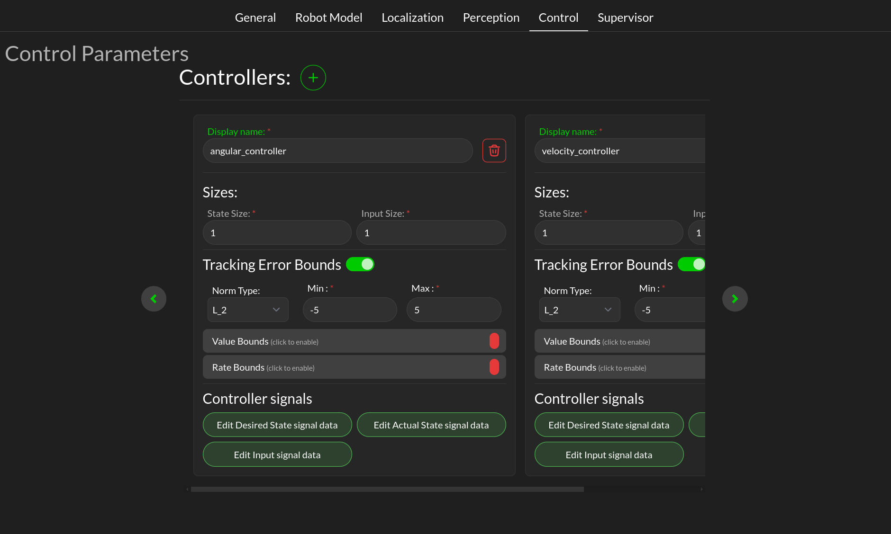

Control
###########

.. _config_control:

This tab let you define controllers.

Here are available parameters:

* **Sizes**: Size specification of the input (output of the controller) and state (input of the controller) vectors.
* **Tracking error bounds**: This needs to be set to get tracking error value. This let you specify a norm and its bounds.
* **Value Bounds**: Per component value bounds of the state (desired and actual).
* **Rate Bounds**: Per component rate bounds of the state (desired and actual).

* **Controller Signal**: Let you specify the controller input and output signals. This will open a drawer component that let you specify a ROS topic and the bound of the signal.

.. important::

  All signals must be defined to get data from the controller health metric. The RDM needs to know which topic are considered desired, actual state of the controller and the controller output.
