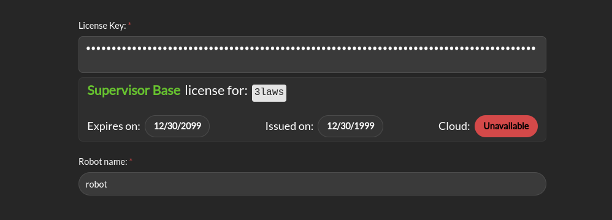

Credentials
###########

The *Credentials* page appears as follows:
When entering a license key, meta information about the license will be displayed. This information includes the expiration date, issue date, and the cloud option associated with the license. If the license key is invalid, an error message will be displayed.

- **Credentials**: 3Laws will provide a license key based on the version of Supervisor that has been purchased/downloaded.  The license key incorporates an expiration date. If a trial license was obtained, the expiration date is 60 days from the request date for the trial.
- **Robot Name**: This identifier will be different for each robot where Supervisor is installed. It should contain a name you can use to identify an individual robot. Note that each license of Supervisor is only valid for a single platform/robot.
