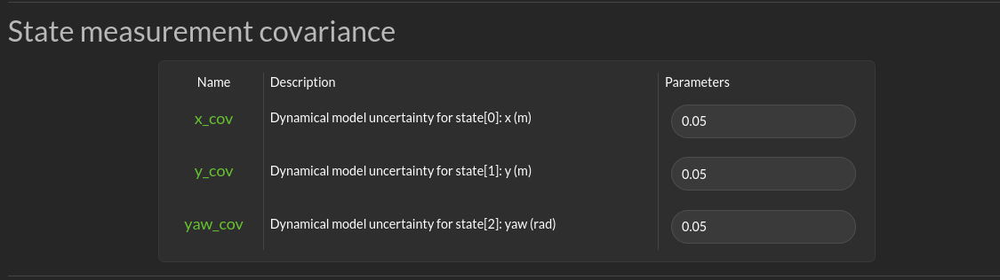
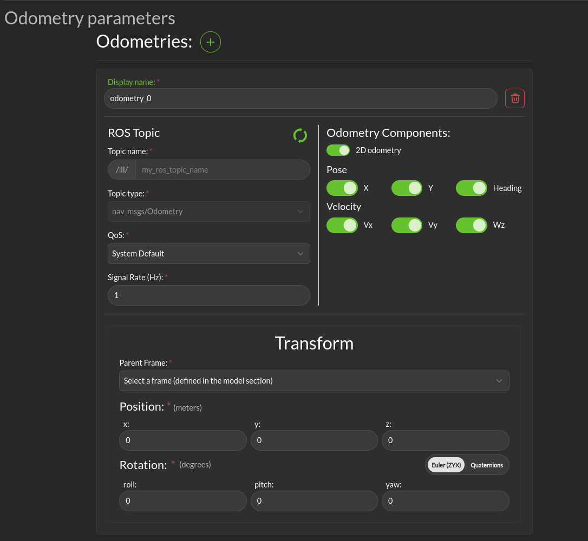

Localization
############

Localization topic
------------------

Dialogs to connect to the state information provided for the robot are on the **Configuration > Localization page**.

.. image:: ../../data/cpanel4.png
  :align: center
  :width: 600px
  :alt: Configuration > Localization Tab

|

- **Localization topic**: The connection to the ROS state topic is configured in this area. As with input commands, the message topic name, message topic type, expected message topic quality, and expected message rates are specified. If the message quality fails or the message receipt rate is not met, the monitor will issue alerts, and the Superisor (Run-time Assurance) will switch to the Failsafe strategy. The mask needs to be customized if the localization topic does not respect the standard ROS message. The index mapping from the input vector to the expected states (x-position, y-position, yaw) needs to be set.  The primary use of the localization message is to provide a MarkerArray for visualization mapped to a global/odom frame rather than providing just the base-frame view where the frame stays still and the outside world moves relative to it.

State measurement covariance
------------------------------

This section allows you to specify the uncertainty of the state. This will be used both by the diagnostic module and the run-time assurance module to integrate into the filtering the uncertainty of the measure.

|

The fields depends on the model. They are self described in the GUI.

Odometry parameters
-----------------------

This section allows you to specify the odometries end point and their respective parameters.

Multiple odometries can be specified.

|

* **Display name**: The name of the odometry.

* **ROS topic**: The odometry ROS topic params

* **Odometry Components:** Here you can specify which components of the odometry the message will contain. The following components are available:
  * **X**: The x position component.
  * **Y**: The y position component.
  * **Heading**: The yaw position component.
  * **Vx**: The velocity component along the x axis.
  * **Vy**: The velocity component along the y axis.
  * **Wz**: The rotation velocity component along the yaw axis.

* **Transform**:
  * **Parent Frame**: The parent frame of the odometry.
  * **Position**: The position of the odometry in it's parent frame.
  * **Rotation**: The rotation of the odometry relative to it's parent frame.

