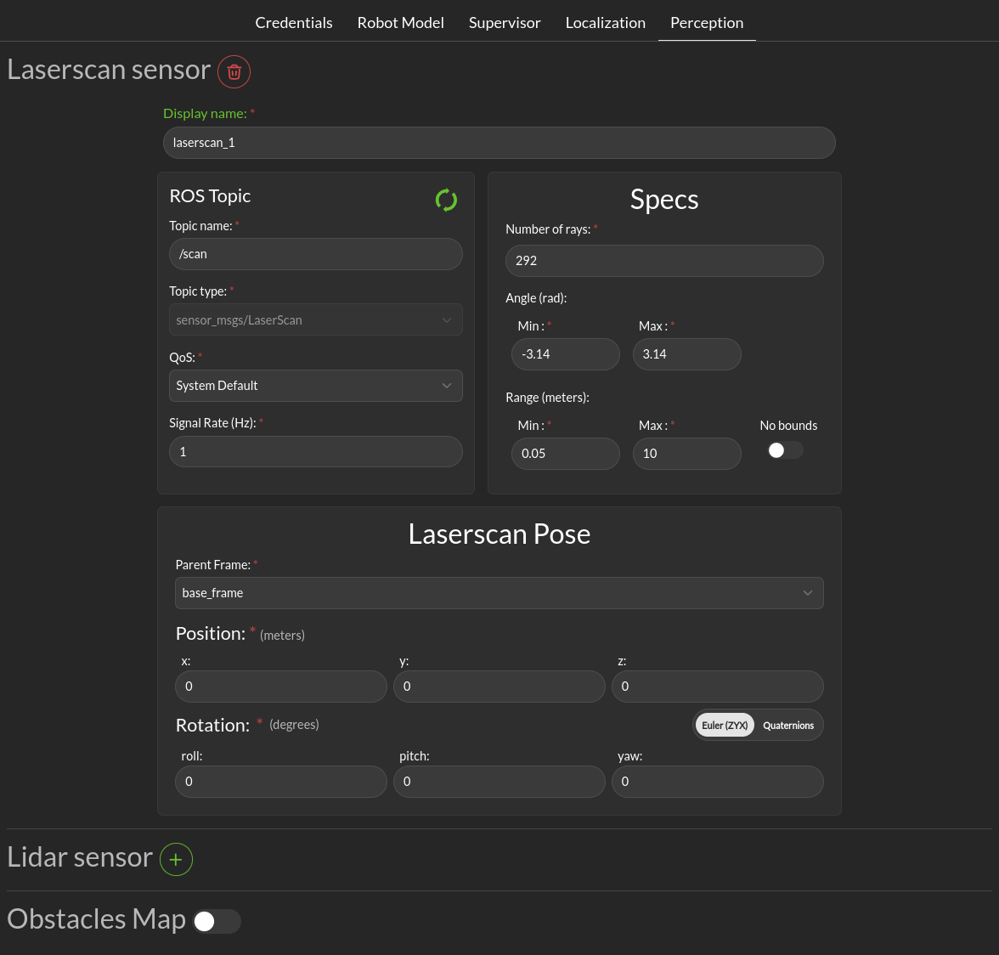

Perception
##########

Collision avoidance uses settings in this dialog to describe the sensors used during operation.

.. _config_perception_laserscan:

- **Laserscan sensor**: The Supervisor processes data points from a single 2-dimensional laser scanner.

  * **Display name**: This display name is used when aggregated statistics about the scanner are uploaded to the 3Laws cloud dashboard. This name is chosen by the user to help keep track of the scanner, e.g. "front_laser".

  * **ROS Topic**: Supervisor needs to subscribe to the ROS message published by the laserscan, so this topic name (plus type, quality-of-service, and expected signal rate) need to match the sensor's output. *ros2 topic* with options *list, info, hz* can be useful to obtain this information.

  * **Specs**:  The expected number of points per scan along with the first (typically minimum) and last (typically maximum) angle must be specified so that the angular resolution can be calculated for the nominal case. The first and last angle values should normally describe a laser that scans in the clockwise direction, so the first is smaller than the last. However, if the laser scans in the counter-clockwise direction the first angle should be set to be smaller than the last. It is very important that the total range of the laser is less than 2π. The Supervisor does not disambiguate angles if the total field is larger than 2π. The scanner's range can be set so that readings smaller than the minimum or larger than the maximum are discarded.

  * **Laserscan Pose**: The orientation and position of the laserscan relative to the vehicle body or whichever frame is used must be specified. As with the robot's body position, the user is advised to plot the data in rviz to ensure that the geometry is set correctly.

- **Lidar sensor**: The Supervisor processes data points from a single 2-dimensional lidar (X,Y point list).

  * **Display name**: This display name is used when aggregated statistics about the scanner are uploaded to the 3Laws cloud dashboard. This name is chosen by the user to help keep track of the scanner, e.g. "front_lidar".

  * **ROS Topic**: Supervisor needs to subscribe to the ROS message published by the LIDAR, so this topic name (plus type, quality-of-service, and expected signal rate) need to match the sensor's output. *ros2 topic* with options *list, info, hz* can be useful to obtain this information.

  * **Specs**:

    * **Number of rays**: The number of rays emitted by the LIDAR (point number).

    * **Range**: The maximum range of the LIDAR in meter.

  * **Laserscan Pose**: The orientation and position of the laserscan relative to the vehicle body or whichever frame is used must be specified. As with the robot's body position, the user is advised to plot the data in rviz to ensure that the geometry is set correctly.

.. _config_perception_obstacles:

- **Obstacle Map**: An existing perception system can be used instead of raw 2D-LIDAR data, but it must provide an ObjectArray that matches the definition for an lll_msgs/ObjectArray (see :ref:`Run-time Assurance Module section <rta_obstacles>`).
