.. _supervisor activation:

Supervisor
###########

.. contents:: Table of Contents
   :local:
   :depth: 2

This page contains configuration entries for both the monitoring and Run-time Assurance Module components.

Supervisor Interface
====================

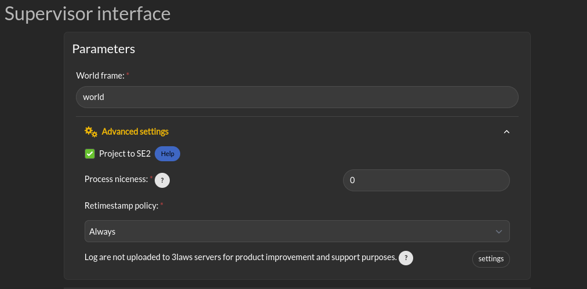

.. _config_sup_world_frame:

Desired Control Input and Computed Safe Control Input
------------------------------------------------------

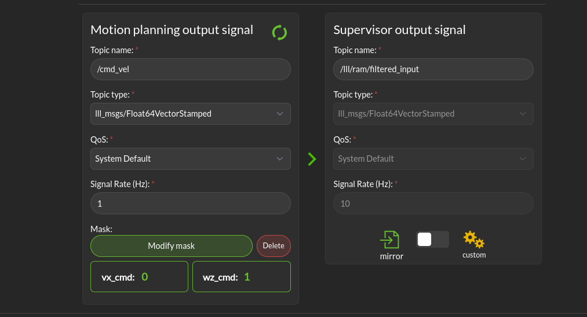

This is where you can define the ROS topic that the Supervisor should listen to for the desired control input. It takes as entries the topic name, its type, Quality of service, signal rate and an optional mask.
The output of the filter is published on the Computed Safe Control Input topic. The Supervisor will only modify the control input if the Enabled checkbox is checked.
This topic can either match the entry topic specs or be a compatible type. It's published at the filter rate.

* **Motion planning output signal**: This is the set of commands requesting speed and rotation (or speed and steering) that the autonomy stack is publishing. The ROS message type is needed so that Supervisor knows what to monitor in order to calculate the barrier function value. The message quality and receipt rate are monitored as part of the aggregated metrics, and if it fails to arrive within the expected time [1/(signal rate) * Timeout factor], an event will be created and the Run-time Assurance Module will transition to the failure command mode.

* **Supervisor output signal**: This is the output of the supervisor Run-time Assurance Module. This topic configuration can mirror the Desired control input one or have a different message type and QoS (the rate is set by the :ref:`filter rate <config_sup_filter_rate>`). The message type can be: the same as received on the Desired control input, an equivalent one (You can convert from timestamped message to non timestamped, with or without covariance for example) or a dynamic type like lll_msgs/Float64VectorStamped or std_msgs/Float[32/64]MultiArray. This limitations are due to the fact that converting types to others can lead to loss of message information. ROS has semantic messages and converting message from a type to another can lead to various errors and misinterpretations.

Run-time Assurance Module
=========================

General Parameters
------------------

.. image:: ../../data/supervisor_general_parameters.png
   :width: 800px

* **Parameters > Enabled**: This checkbox controls whether the run-time assurance intercepts and modifies commands from the planner/trajectory generator and forwards modified versions to the vehicle. The Run-time Assurance Module will only modify the outputs if the option is activated. If it is not activated, the unmodified "desired control input" will be transmitted on the designated "Computed safe control" message.  Additionally, when activated the Run-time Assurance Module passes the unmodified desired input through to the platform except when a corrective action is needed.

.. _config_sup_collision_distance:

* **Parameters > Collision distance threshold**:  This is one of the most important values to set. This defines the distance between the edge of the robot and the nearest scan at which safety exists. If the measured distance drops below this value, the system is considered to be in an "unsafe" configuration.

.. _config_sup_filter_rate:

* **Parameters > Filter rate (hz)**: The frequency at which the run-time assurance publishes outputs. It is recommended that the run-time assurance run at the same rate as the desired control input or at a faster rate.

.. _config_sup_tuning:

Tuning
--------

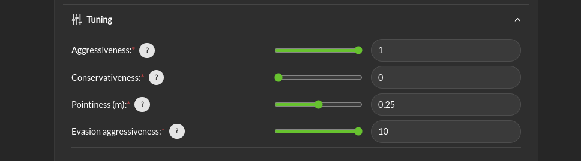

* **Tuning > Aggressiveness**: This parameter controls how far from the nearest obstacle the safety filter starts having more effect on the commands and how strongly the safety filter pushes the robot back into the "safe" region if the safety definition has been violated. A larger value means that the control inputs from the planner will start to be modified when the robot is closer to an object/obstacle. That is, a larger value allows the platform to approach objects faster, and get closer.  If it gets too close, the Supervisor will push away from the object harder with a higher value.  A lower value will lead to a more tentative travel that stays farther away from objects.  In general lower values will produce larger margins. Typical values are between 0.5 and 1.0, but values in the range of 1000 might be used in reasonable situations.

* **Tuning > Conservativeness**: This parameter controls how early the filter start to break when approaching an obstacle. Higher value are preferred when the localization and/or the perception are uncertain

* **Tuning > Pointiness**: A rectangular (box) shape has an unintended behavior that if the robot comes towards a narrow object directly in front of it, the closest point calculation will select the center-line of the box as the evaluation point for distance.  If the outer corners get closer to the object, the barrier function will want to increase the distance between the object and the box, so it will tend to center the box relative to the object.  A more desirable behavior is for the box to turn away from the object to be able to get around it.  The *pointiness* parameter is a way of accomplishing this.  If the box has a nose with sharper curvature, the barrier function will push it away from the object laterally, rather than simply trying to increase the measured closest distance between the box and the object.  So increasing the "pointiness" will encourage the vehicle to "turn away" from obstacles that are directly in front.

* **Tuning > Evasion Aggressiveness**: Balance between keeping momentum or slowing down to avoid obstacles.

.. _config_sup_fault_management:

Fault Management
----------------

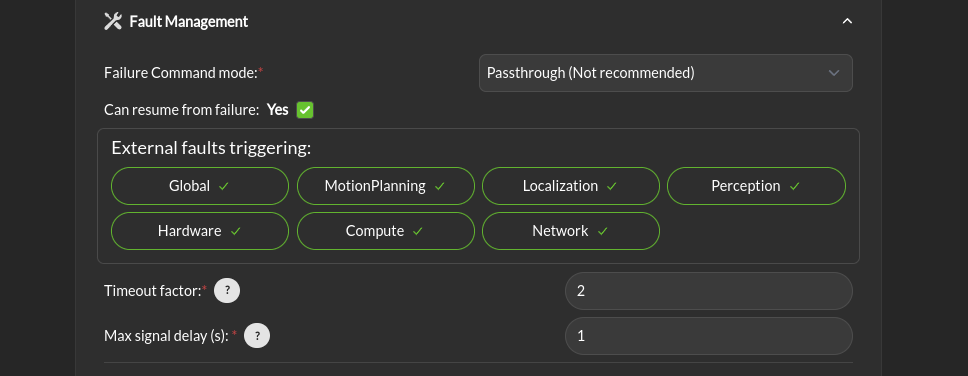

* **Fault Management > Failure Command Mode**: The run-time assurance constantly monitors to ensure that it has enough data to determine whether the robot is in a safe condition. The minimum data required is the vehicle state, the laser scan values, and the commanded/desired input. If any of these is missing the RTA can switch to the failure command mode:

   * **Send Zero**:  In this mode the run-time assurance commands zero speed and zero turn/rotation in order to bring the vehicle to a stop.

   * **Do not Publish**:  Another option is to stop publishing values. This option should only be used if the robot has its own mechanism to put itself in a safe condition if it is not receiving commands.

* **Fault Management > Can resume from failure**: With this checkbox filled in, once the input data (control input, laser scan, and state) values start appearing after a failure, the robot will be commanded back into motion (if the desired control input is asking for that). If the box is unchecked once there is a failure, the robot will remain stopped until the Supervisor is restarted.

* **External Fault triggering**: This represent the list of domain that will trigger an error in the RTA stack and fallback to the failure command set above.

* **Timeout Factor**: Allows how much time the RTA can wait before considering the input timed-out. The timeout threshold is calculated as [1/(signal rate)] * Timeout factor.

* **Maximum Delay (s)**: Maximum amount of time that a message can have between send timestamp and receive timestamp before reporting an error.

Advanced Settings
-----------------

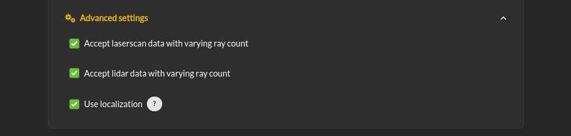

* **Advanced Settings > Accept laserscan data with varying ray count**: One of the checks that is made on the incoming data is that the laserscan is delivering the expected number of scan points each frame. However, there are many laser scanners that are not consistent in the number of scan points they deliver. Checking this option allows for laser scanners with non-constant number of scan points reported.

* **Advanced Settings > Accept lidar data with varying ray count**: One of the checks that is made on the incoming data is that the lidar is delivering the expected number of scan points each frame. However, there are many laser scanners that are not consistent in the number of scan points they deliver. Checking this option allows for laser scanners with non-constant number of scan points reported.

.. _config_sup_loc:

* **Advanced Settings > Use localization**:  Supervisor provides a MarkerArray that displays the robot's bounding box and rays to the closest obstacles. If "Use Localization" is set, the display is created relative to the world frame. In situations where the localization may be less reliable, this checkbox can be deselected, and the visualization will be based on the current robot base frame. Localization is also very useful if the control rate is low (e.g. longer times between commands) or there are delays between sensing and actuating. If the robot's motion is large during the time period of the control calculation, the model will account for it as long as localization is accurate.

Monitoring Module
==================

.. image:: ../../data/supervisor_monitoring_module.png
   :width: 800px

Supervisor can publish a variety of diagnostic messages related to the health of the system clock, the dynamic consistency of the motion of the platform, individual node health, signal coherency, and summarized system health.  The published messages are discussed in :ref:`Ros Topics <reference_ros_topics>`.   These messages in the */lll/rdm* domain are only published if the Monitor is set to Active.

 * **Enabled**: Enable publication of the diagnostic messages through the */lll/rdm* domain.  Faults detected in these variables do not cause Run-time Assurance Module to switch to the failsafe mode.

 * **Timeout Factor**: Allows this many messages at the expected arrival rate to be missed before reporting an error.

 * **Maximum Delay (s)**: Maximum amount of time that a message can fail to appear before reporting an error.

Odometry Consistency
--------------------

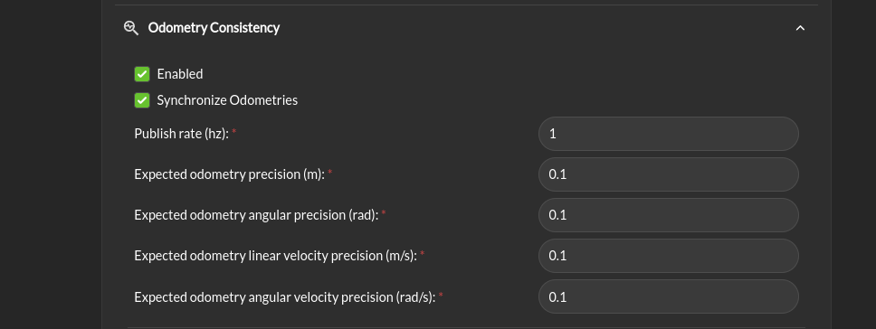

* **Odometry Consistency > Enabled**: Enable the odometry consistency check. This check will compare the odometry data with the laser scan data to ensure that the robot is moving in a consistent manner. If the robot is not moving in a consistent manner, the system will issue a warning.

* **Synchronize Odometries**: Should the odometry be synchronized and check will happen after enough data has been collected to have a time overlap.

* **Publish rate**: The rate at which the odometry consistency check is published.

* **Expected odometry precision**: The expected precision of the linear odometry data. If a comparison between two odometries exceed this value their pair is considered inconsistent.

* **Expected angular odometry precision**: The expected precision of the angular odometry data. If a comparison between two odometries exceed this value their pair is considered inconsistent.

* **Expected linear velocity odometry precision**: The expected precision of the linear velocity odometry data. If a comparison between two odometries exceed this value their pair is considered inconsistent.

* **Expected angular velocity odometry precision**: The expected precision of the angular velocity odometry data. If a comparison between two odometries exceed this value their pair is considered inconsistent.

Dynamic Consistency
-------------------

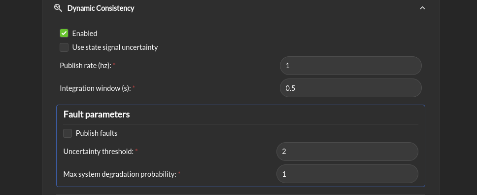

* **Dynamic Consistency > Enabled**: Enable the dynamic consistency check. this check will compare the model and the actual behavior of the robot to detect model errors.

* **Use state signal uncertainty**: If the state signal contains a covariance matrix, the uncertainty will be used to compare the model and the actual behavior of the robot if this box is checked.

* **Publish rate (hz)**: The rate at which the dynamic consistency check is published.

* **Integration window (seconds)**: The time window over which the state is integrate to compare the model and the actual behavior of the robot. This should be smaller than the publish rate

* **Fault parameters > Publish faults**: If this box is checked, the faults detected by the dynamic consistency check will be published as fault for the RTA module.

* **Fault parameters > uncertainty threshold**: The threshold above which the dynamic consistency check will issue a fault.

* **Fault parameters > Max system degradation probability**: The maximum probability of system degradation that the dynamic consistency check will accept before issuing a fault.

Behavior safety
---------------

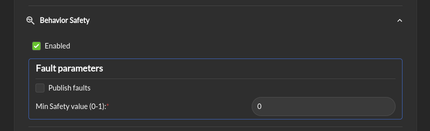

* **Behavior safety > Enabled**: Enable the behavior safety check. This check will compare the behavior safety score to a predefined threshold and issue a fault if the behavior safety score is below the threshold.

* **Fault parameters > Publish faults**: If this box is checked, a behavior safety score under the threshold will be published as a fault for the RTA module.

* **Fault parameters > Min safety value (0-1)**: The minimum value of the behavior safety score under which a fault will be issued.

System Health
-------------

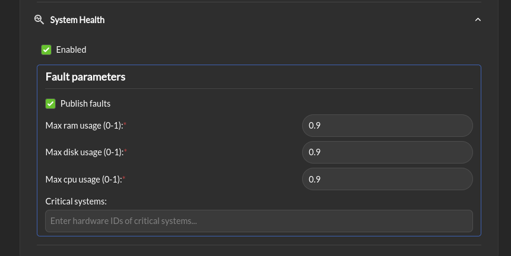

* **System Health > Enabled**: Enable the system health check. This check will compare the system health to a predefined threshold and issue a fault if the system health is below the threshold.

* **Fault parameters > Publish faults**: If this box is checked, a system metric above its respective threshold will be published as a fault for the RTA module.

* **Fault parameters > Max ram usage (0-1)**: The maximum percentage of the used RAM above which a fault will be issued.

* **Fault parameters > Max disk usage (0-1)**: The maximum percentage of the used disk above which a fault will be issued.

* **Fault parameters > Max cpu usage (0-1)**: The maximum percentage of the used CPU above which a fault will be issued.

* **Fault parameters > Critical systems**: list of system (hardwareId) that are critical for the robot to operate. If one of these system is not operational a fault will be issued.

Extra stack info
----------------

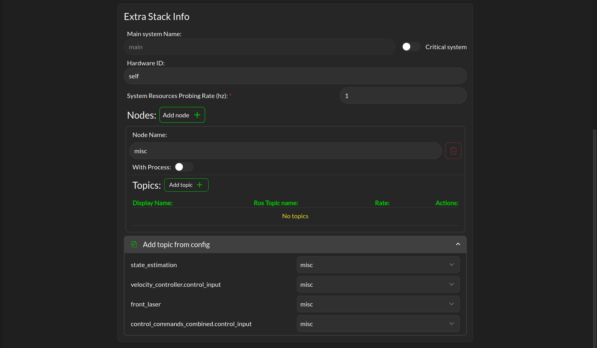

This section allows you to add extra topic and node outside of those already define by the mandatory configuration. It let you also map the defined topic of the mandatory configuration to a node.

Supervisor activation logic
===========================

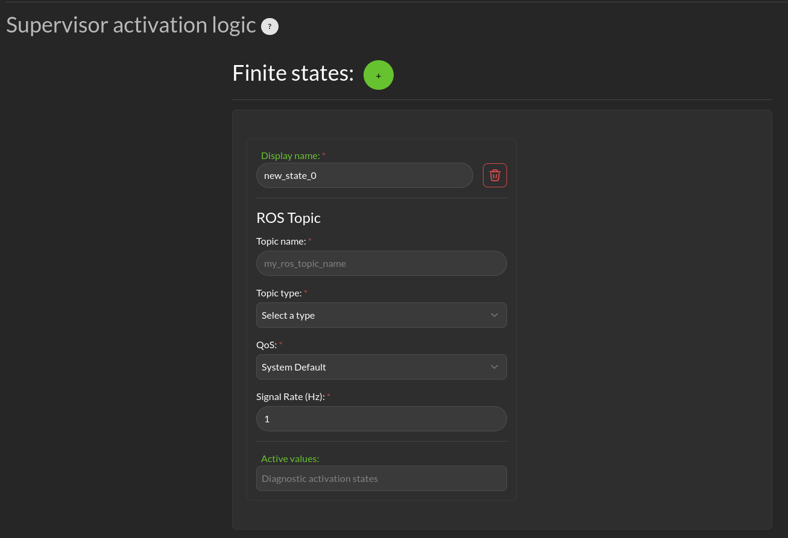

The bottom section relates to republishing the control commands to the robot that are being sent from the autonomy stack. The values will be published on the *lll/ram/filtered_input* (default topic name, can be customized) channel  if the Run-time Assurance Module is activate or not. However, the values will only be different from the *Desired control input* if the Run-time Assurance Module is active.

* **Finite States** are messages that the Diagnostics can listen to and issue events when the value of the finite state matches a predefined value.
