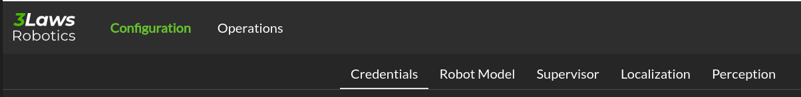

Control Panel
##############

.. contents:: Table of Contents
  :local:

Overview
=========

The control panel is a web-based configuration and monitoring tool for the Supervisor. It is composed of two main sections:

  - Configuration: This section allows the user to configure the Supervisor's parameters.

  - Operations: This section shows the current state of the Supervisor and the robot.

Each section is accessed by clicking on the corresponding tab in the Control Panel:

.. image:: ../data/cp_tabs.png
  :align: center
  :width: 800px
  :alt: Control Panel tabs.

|

A section is also divided into sub-sections, which are accessed by clicking on the corresponding sub-tabs:

|

In addition, the navigation bar gives you access to other information, namely the documentation, instruction on how to launch the Supervisor ROS node, and a rosbridge connection status.

Rosbridge connection
=====================

The Control Panel is most effective when used with a ROS bridge server. This server provides a websocket interface to ROS topics. With this interface, the Control Panel can retrieve information about the **available topics** and help you complete the configuration of the Supervisor.

To install a Rosbridge server (where <distro> is replaced with the version of ROS on the system), run:

.. code-block:: bash

  sudo apt-get install ros-<distro>-rosbridge-server

The Rosbridge server can be started with the following command:

.. tabs::
   .. tab:: ROS1
     .. code-block:: bash

       roslaunch rosbridge_server rosbridge_websocket.launch

   .. tab:: ROS2
     .. code-block:: bash

       ros2 launch rosbridge_server rosbridge_websocket_launch.xml

This will provide a websocket server at **`ws://localhost:9090`**. The Control Panel can connect in order to retrieve topic and service information.

The navigation bar of the control panel shows the status of the rosbridge server connection:

.. image:: ../data/navigation_bar_rosbridge.png
  :width: 800px
  :alt: Control Panel NavBar with ros bridge connected.

A **green** status icon indicates that the Control Panel is connected to the Rosbridge server, while a **red** icon indicates that the Control Panel is not connected.

By clicking on the icon, you can set the IP address and port of the Rosbridge server to which the Control Panel should connect.

.. image:: ../data/rosbridge_connection_modal.png
  :align: center
  :width: 800px
  :alt: Rosbridge connection dialog.

|

.. note::

  During the configuration process, the Control Panel can be used without a Rosbridge server, but the autocompletion for topics and the operation tab will not be available.

.. _control_panel_config:

Supervisor Configuration
========================

The Supervisor's configurable fields are available through a series of pages in the Control Panel.  Each of the following sections corresponds to a tab in the Control Panel. The tabs are:

The **Save** button on each page of the Control Panel should be pressed to record the current page in the *supervisor.yaml* file before moving on to another page.

Throughout this documentation, a red asterisk (*) indicates a *required* field.

.. toctree::
  :maxdepth: 1

  1. Credentials <configuration/credentials>
  2. Model <configuration/robot_model>
  3. Supervisor <configuration/supervisor>
  4. Localization <configuration/localization>
  5. Perception <configuration/perception>

.. note::

  The configuration is saved in the `~/.3laws/config/supervisor.yaml` file.

.. warning::

  The Control Panel has a topic autocompletion capability that depends on the Rosbridge server. The robot's stack (without Supervisor) needs to be running and publishing topics for this feature's proper operation.

.. _control_panel_ops:

Control Panel's Operations Page
===============================

Status
------

.. image:: ../data/cp_operation.png
  :align: center
  :width: 800px
  :alt: Operations page showing a configured robot that does not yet have sensor or planning data.

|

In the image above, the Supervisor is operational and all the components necessary for proper collision avoidance are configured to be active as indicated by the arrows between them.

If some of the components are not yet operational, the Control Panel will show the boxes in different colors (orange for warning, red for errors).
To get additional information about the error, you can check the logs under the diagram or click on the Status on top of the box to get details on the error source.

.. image:: ../data/cp_operation_error.png
  :align: center
  :width: 800px
  :alt: Operations page showing a configured robot that does not yet have sensor or planning data.

The above image shows a situation where all components are done. We have clicked on the detail status of the Motion Planner components.

A **blue** box indicates that the component is not yet operational and still initializing.

The lower section of the panel show logs and strip charts. The categories that are currently displayed include:

- **Latest logs**: Shows the most recent event from the RAM's Fault Manager.

- **State Safeness**: the Barrier Function (safety-related metric) value. When this value goes to zero or below zero, the system is evaluated as being in a collision state.

- **Input Modification**: When this value is zero, the Run-time Assurance Module is passing the input from the planner through to the lower-level UNchanged. That is, the filtering is in passive mode. When this value is non-zero, the Run-time Assurance Module is actively modifying the commanded input.

.. warning::

  In order to make this page work, the Rosbridge server needs to be active, and the Control Panel must connect to it.

.. _control_panel_viz:

Visualization
-------------

Visualization of the Runtime Assurance Module (RAM) metadata is available through `Rviz <https://wiki.ros.org/rviz>`_. This tab of the control panel will provide you with a link to download an Rviz configuration file consistent with the current Supervisor configuration.
